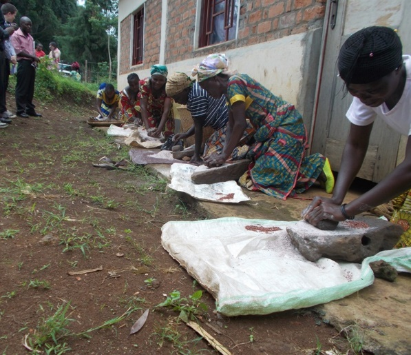
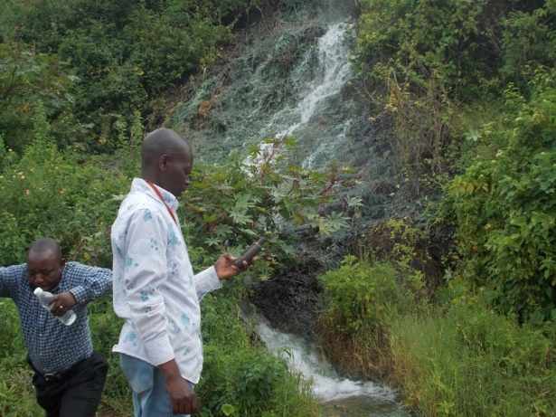
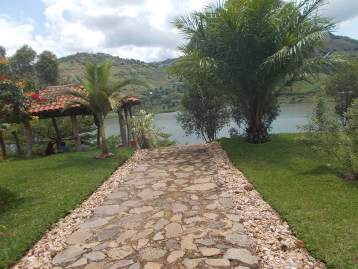

## 1. Visiting the activities of surrounding communities in Miti villages

* 7h30: Departure from hotel in Bukavu to the village of Miti
* 8h15: Arrival to Miti village and visiting community activities:    
       - Observing works with the traditional mill (flat stone) for grinding sorghum,   
       - Listening to the stories about meals with sorghum flour,  
       - Observing games of sombi, dense to the rythm of the kihobe and likembe as local instruments   
* 10h00: Departure from Miti to Mahyuza for the thermal waters   

## 2. Visiting Mahyuza themal water at Katana
  

* 10h30: Arrival at Mahyuza and visiting the thermal waters in the Kachungunu concession  
        - Observing the source of the thermal water and the route to the lake,   
        - Touching to feel the thermal water, bathing and bottling if you like,  
        - Listening to the vertues of the thermal waters for years.  
* 11h15 : Departure from Mahyuza thermal waters for the Atmosphere Recreation Site   

## 3. Visiting the Atmosphere Recreational site at Chinjava (Bosingisi’s property) 

* 11h45: Arrival at the Atmosphere Recreational site  
        - Throwing bouncing stones on the lake,  
        - Observing the race of boatmen, 
        - Observing the competing swimmers.   
* 13h00: Lunch at the Atmosphere site,  
* 14h00: Musical relaxation by the lake,
* 15h00: Return to hotel in Bukavu.

## 4. Requirements and charges in US Dollars

Car hire (from 6 a.m. to 5:30 p.m.) | 100 (per tourist group)
Contribution for the Miti site | 40 (per group)
Contribution for the thermal water site	 | 20 (per group)
Contribution for competing teams at the Atmosphere site | 60 (per group)
Meal and drink consumption/sparkling water| 15 (per person)
GTS admin fees and guide for one whole day |	100 (per group)

Package: | $320 per group + $15 per person|1 person =$335|2 persons =$350|3 persons =$365 etc.

<!--- Package	| USD par X nombre + équipes des touristes --->

<!---
This is page No. 5
<figure class="third">
	
	
	
	<figcaption>Caption describing these three images.</figcaption>
</figure>

and here is even MORE text --->
