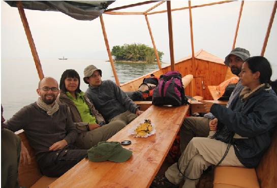
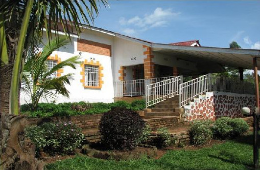
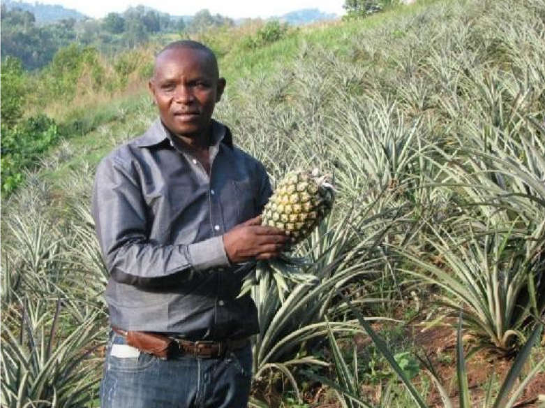

# 1. Randonnée sur le lac, gouter l’ananas, visites

6h30 : Départ de l’hôtel vers le boat pour Idjwi  
7h15 : Embarcation et début du voyage sur le lac              
10h30 : Arrivée à Idjwi-Sud, Kashofu et hôtel  
13h00 : Visite des plantations d’ananas  
14h00 : Visite plantation de bananier à Kintama  
15h00 : Repas et repos à l’hôtel Congomani  
16h00 : 

## 2. Visite Plantation ananas, briqueterie, et Groupe Grotte
  

7h30 : Petit déjeuner à l’hôtel Congomani  
8h45 : Promenade au bord du lac et visite de la briqueterie locale de Kishofu  
10h45 : Départ visite à la Grotte Mani (13m)  
12h00 : Visite Groupe folklorique Yunva-Lero  
13h30 : Retour à l’hôtel, repas et repos  
15h00 : Visite carrières de sable à Kintama    
16h30 : Retour à l’hôtel  

## 3. Besoins et frais en dollars américains  

Frais location boat pour 2 jours et demie |||| 250 (par l’équipe des touristes)
Frais de chambre d’hôtel par nuitée |||| 40 (par touriste)
Enveloppe-cadeau plantation d’ananas |||| 20 (par l’équipe)
Enveloppe-cadeau plantation bananiers |||| 20 (par l’équipe)
Enveloppe-cadeau briqueterie |||| 20 (par l’équipe)
Enveloppe-cadeau briqueterie ||||	20 (par l’équipe)
Enveloppe-cadeau carrière de sable |||| 20 (par l’équipe)
Enveloppe-cadeau Groupe Yunva-Lero|||| 60 (par l’équipe) 
GTS et guide pour un seul jour de visites||||	100 (par l’équipe)
Package | $510 par l'equipe + $40 par personne| 1 personne =$550| 2 personnes =$590| 3 personnes =$630 etc. 
