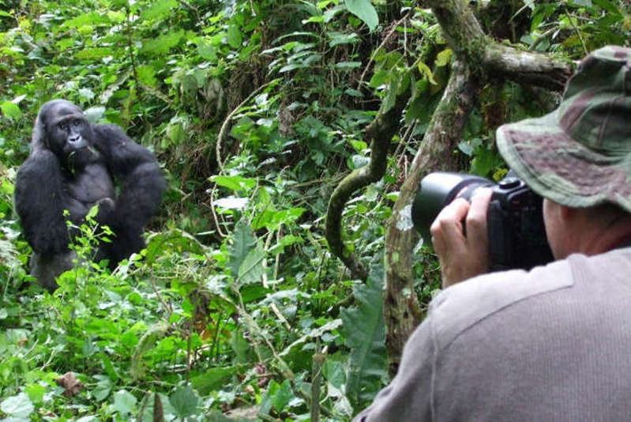
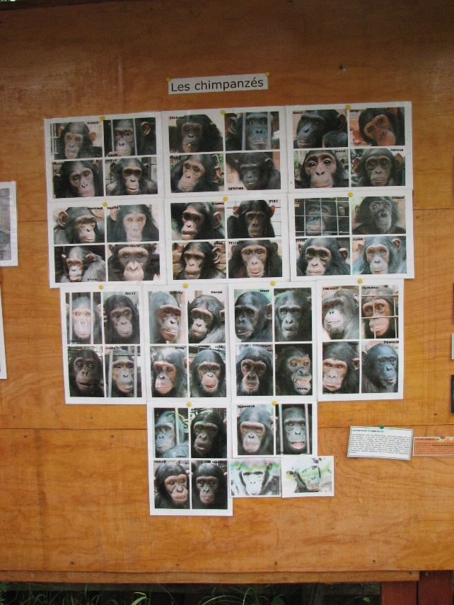

## TOURISTIC NATURE VISIT

Visit the Grauer's Gorillas in Kahuzi Biega National Park and Chimpanzees at the Primate Rehabilitation Centre at Lwiro (CRPL)

# Visit the gorillas in the park

* 6h30: Departure form hotel in Bukavu

* 7h30 : Arrival at the reception of the park, free tea/coffee, administrative and financial formalities

* 8h00: Briefing about the visit of the PNKB gorillas. You can ask all your questions                                                                                 
* 9h00: Departure to the visit in the forest. More or less an hour's walk to the gorilla group; the  visit lasts one hour from reaching the group

* 10h00: Return to the Park office, then departure to CRPL at Lwiro

# Visit the chimpansees at the Primate Rehabilitation Centre at Lwiro (CRPL)

* 12h00: Arrival at the  CRPL reception; administrative and financial formalitie, briefing   
* 12h30: Begin of the chimpanzee visit; duration: one hour 
* 13h30: End of visit, return to reception, coffee break, and chance to check the souvenir shop 
* 14h00: Meal at Lwiro Guest House --- (Reserved two days earlier)
* 15h30: Return to Bukavu  
* 16h30: Arrival at Bukavu, or at the border RDC/Rwanda for transiting travellers.

# Requirements and charges in US Dollars  

Gorilla Tracking Permit / PNKB | 400 (per person)
Entrance fee to see the chimpanzes at CRPL |  40 (per person)
Meals at Lwiro Guest-House  | 15 (per person)
Vehicle rent (from 6 a.m. to 5:30 p.m.) | 120 (for the group)
GTS admin fees and guide for one whole day | 100 (for the group)

Package: | $220 for the group + $465 per person|1 person =$685|2 persons =$1150|3 persons =$1615 etc.

 <!--- Package :	USD par X nombre + équipes des touristes --->
