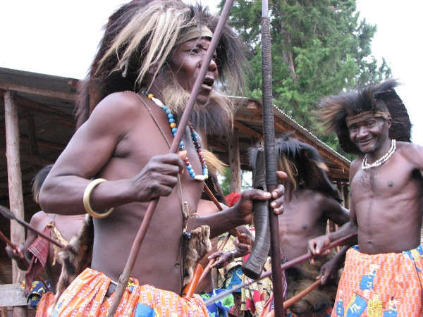
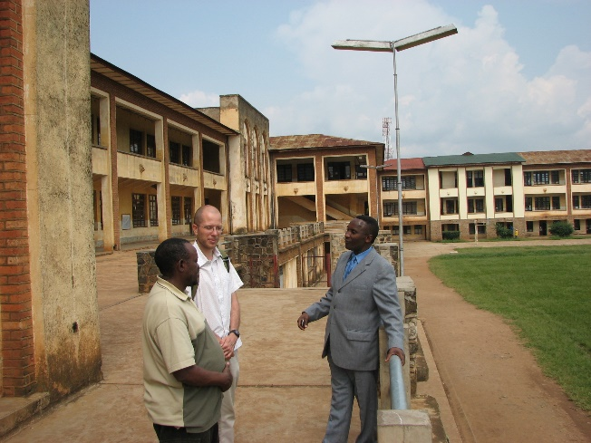

# Visite à la cour royale de Kabare et tour de la ville de Bukavu

## Visite à la cour royale 

* 9h30 : Départ de l’hôtel à Bukavu
* 10h30 : Arrivée à Kabare : 
* Révérence à Sa Majesté Mwami Kabare ;
* Observation des danseurs ntoles ;
* Entretien avec les sages, détenteurs de la coutume royale ;
* Ecouter les griots de la cour royale ;
* Photos de famille Sa Majesté puis avec chaque groupe ;
* Repas offert par la cour royale (si le rendez-vous de visite annoncée avant).
* 12h00 : fin de la visite et retour à Bukavu

## Visite au Collège Alfajiri, Cathédrale et Karhale, berceau des effets des différentes guerres

* 12h45 : Arrivée et visite guidée des sites du Collège Alfajiri, 
* 13h30 : Fin de la visite au Collège (histoires, sites, etc.)
* 14h00 : Arrivée et visite des sites historiques et effets des guerres à la cathédrale 

* 15h00 : Visite au grand marché de Kadutu (beaucoup de précaution avec les poches et objets en mains comme petits sacs, téléphones….) et départ pour le site Karhale 
* 16h00 : Arrivée au site Karhale : sommet SOS village pour enfants, observation panoramique de la ville de Bukavu et des abords du lac Kivu  
* 16h30 : Retour à l’hôtel à Bukavu.  

## Besoins et frais en dollars américains  

Enveloppe d’équipe pour la famille royale | 200,00 (par l’équipe des touristes)
Enveloppe-cadeau aux sages et griots | 50,00 (par l’équipe)
Enveloppe-cadeau aux danseurs ntoles | 50,00 (par l’équipe)
Enveloppe-cadeau au panier du Collège | 50,00 (par l’équipe)
Enveloppe-cadeau panier de la Cathédrale | 50,00 (par l’équipe)
Location véhicule (de 6h00 à 17h30)	| 120,00 (par l’équipe) 
GTS et guide pour un seul jour de visites| 100,00 (par l’équipe)
Package	| 620,00 USD